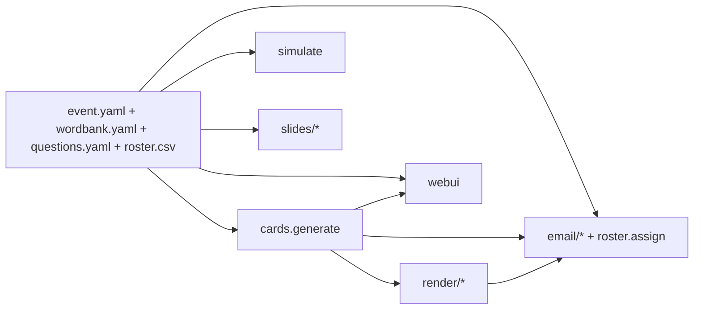

<!-- AUTO-GENERATED from .github/copilot-instructions.md by scripts/sync-ai-instructions.sh. DO NOT EDIT. -->

# Copilot / AI assistant instructions

Single source of truth for any AI assistant working in this repo
(Copilot, Claude, Cursor, Cody, etc.). `AGENTS.md` and `.claude/CLAUDE.md`
are auto-generated mirrors — **do not edit them by hand**; edit this file
and run `scripts/sync-ai-instructions.sh`.

## What this project is

`bingo-trivia-system` is a Python toolkit for running trivia
bingo. It generates per-participant 5×5 cards from a word bank, simulates
win-step distributions, renders printable + fillable PDFs, emails each
participant their card, and serves a presenter UI for game day.

Built for **personal / small-group use**: single-user local server, no
authentication, optional email transports (Microsoft Graph delegated, AWS
SES). Runs on Windows hosts and Linux containers/VMs without Node.

## Architecture in one diagram



Boundary rules:
- `models.py` imports from **nothing** in this package.
- `cards / simulate / winrules / wordbank` use only `models` + stdlib.
- `render / email / webui / slides` may use everything above but never each
  other.
- All cross-boundary types come from `models.py`.

## Local conventions

- **Python 3.11+**, `uv` for everything (`uv sync`, `uv run pytest`,
  `uv run bts ...`).
- **Pydantic v2** for every data shape. Avoid `dict`s in public APIs.
- **typing.Protocol** for backends — see `render/base.py`, `email/base.py`.
- **Determinism**: any randomness derives from
  `hashlib.sha256(f"{seed}:{key}").digest()`. Never call `random.random()`
  without a seed.
- **Imports**: relative within the package
  (`from .models import Card`), absolute from tests.
- **Line length**: 100. Ruff config in `pyproject.toml` is the
  authority — read it before arguing.
- **Don't add a runtime dep** without also adding it to the relevant
  optional extra. The base install must stay slim.

## Critical gotchas (learn from past mistakes)

- `models.EventConfig.starts_at` is **not** named `datetime`. Naming a
  Pydantic field the same as an imported type breaks v2's annotation
  resolver under PEP 563. Apply the same rule for any new field.
- `email-validator` ships via `pydantic[email]` — don't pin it separately.
- `roster.reassign()` must exclude **every** assigned card, not just other
  people's. There's a regression test for this.
- The Typer `--event` option is **per-subcommand**, not global. Use the
  `EVENT_DEFAULT` env var for shell convenience.
- `bts serve` binds `127.0.0.1` only and has no auth. Never change that.

## When adding code

Default to **small** changes. The repo is a toolkit, not a framework.

1. New behaviour → start in `models.py` (the type), then a pure function,
   then a CLI wrapper, then a test.
2. New backend → implement the Protocol, register the lazy import,
   add a `bts doctor` detection, add one smoke test.
3. Touched a module under `src/bingo_trivia_system/` → update the
   corresponding `docs/systems/*.md` page in the **same commit**. The
   `bts docs check` gate enforces 1-to-1 parity.

## Don'ts

- Don't add a web framework other than FastAPI/Jinja.
- Don't add Node, npm, or a build step. Reveal.js loads from CDN.
- Don't add authentication, multi-user features, or remote-write APIs.
  This is single-host single-user by design.
- Don't add WebSockets — SSE is enough for the one-way presenter→admin push.
- Don't add type stubs you didn't write tests for. Don't refactor for
  refactoring's sake.

## Verifying changes

```bash
uv run pytest          # 25+ tests must pass
uv run ruff check .    # zero violations
uv run bts docs check  # docs ↔ code parity
uv run bts doctor      # capability sanity
```

Or `uv run poe check` to run all of the above.

## Decision records

Architectural choices live in [`DECISIONS.md`](../DECISIONS.md). Add a new
entry before reversing any prior decision.
