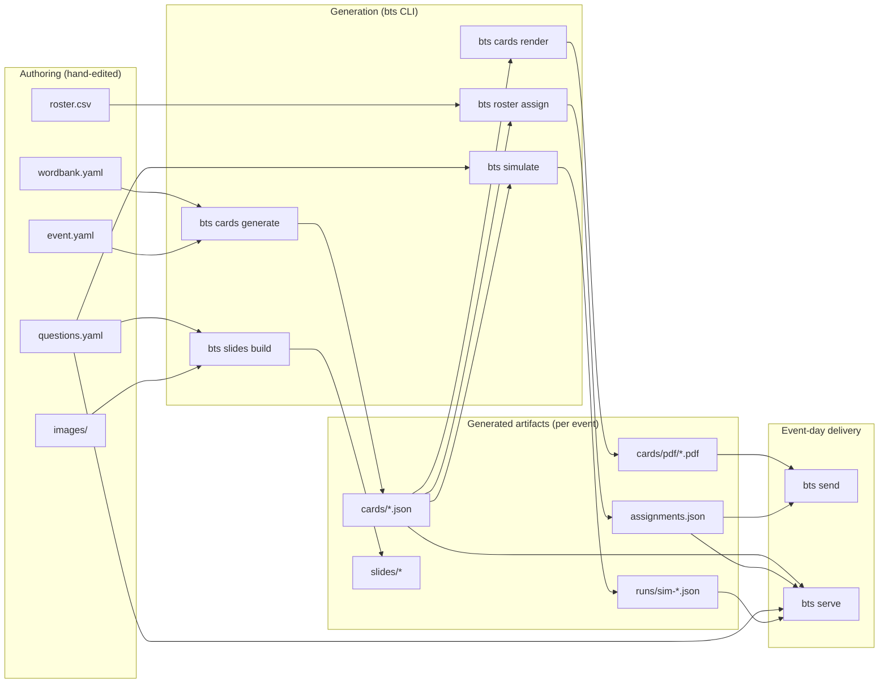

# Architecture

## Module map

| Module | Source | Doc |
|---|---|---|
| Card generation | `src/bingo_trivia_system/cards.py` | [systems/cards.md](systems/cards.md) |
| Simulation | `src/bingo_trivia_system/simulate.py` | [systems/simulate.md](systems/simulate.md) |
| Win rules | `src/bingo_trivia_system/winrules.py` | [systems/winrules.md](systems/winrules.md) |
| Word bank | `src/bingo_trivia_system/wordbank.py` | [systems/wordbank.md](systems/wordbank.md) |
| PDF rendering | `src/bingo_trivia_system/render/` | [systems/render.md](systems/render.md) |
| Email transports | `src/bingo_trivia_system/email/` | [systems/email.md](systems/email.md) |
| Web UI | `src/bingo_trivia_system/webui/` | [systems/webui.md](systems/webui.md) |
| Slides | `src/bingo_trivia_system/slides/` | [systems/slides.md](systems/slides.md) |
| CLI | `src/bingo_trivia_system/cli.py` | thin Typer wrapper; no business logic |

## Boundary rules

- `cli.py` is a thin wrapper. Logic lives in sibling modules.
- `webui/` never calls `cards.generate()` mid-request — cards are generated
  ahead of time and read from disk.
- `simulate.py` is pure-functional: no I/O, no global state.
- Email transports are reached only through `email/base.py:TransportProtocol`.
  Never import `msal` or `boto3` outside `email/`.
- PDF backends conform to `render/base.py:RendererProtocol`. Never branch on
  backend name outside `render/base.py:get_renderer()`.
