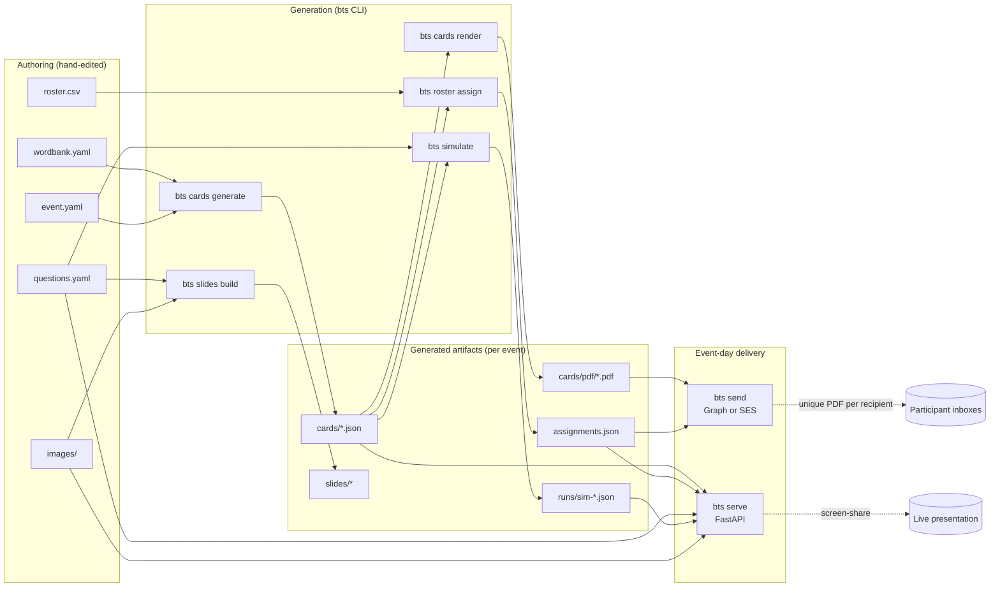

# Initial Repo Plan (archived)

> **Archived:** This is the original planning document that bootstrapped this
> repository. It is preserved with light wording cleanup for public sharing.
> Living documentation lives under [`../`](../) (see `architecture.md`,
> `systems/`, `event-playbook.md`, etc.) and in
> [`../../.github/copilot-instructions.md`](../../.github/copilot-instructions.md).

---

## Overview

A standalone Python repo that powers a 1-hour trivia-bingo event end-to-end:
authoring a word bank → generating unique cards → simulating winners → mass-emailing
unique PDFs → running a local web UI during the event to verify winners and screen-share
their card with answer stamps. Designed to support multiple parallel "events" (e.g. dry
run vs real event) without code changes.

**Recommended approach**: One uv-managed Python 3.12+ package, `bingo-trivia-system`, with a
single `bts` CLI exposing all subcommands; data lives under per-event folders
(`events/<event-id>/...`) keyed by an event ID, so the same code drives dry-runs and the
real game. PDFs use a pluggable renderer (ReportLab by default for Windows portability;
WeasyPrint backend for nicer styling on Linux/VM hosts). Emails use a pluggable transport
with both Microsoft Graph and AWS SES implementations behind one interface.

### End-to-end architecture

---

## Runtime environments

The repo must run cleanly in **three host environments**. Anything that only works in
one of them is gated behind an optional extra or a clear capability check at startup.

| Capability | Windows host (native) | Linux host (VM / bare) | Devcontainer (local Docker or Codespaces) |
|---|---|---|---|
| `bts` CLI (cards, simulate, roster, send, serve) | ✅ via `uv` | ✅ via `uv` | ✅ via `uv` |
| ReportLab PDF backend | ✅ default | ✅ | ✅ |
| WeasyPrint PDF backend | ⚠️ needs GTK runtime + PATH munging — **not recommended** | ✅ native | ✅ pre-baked in image |
| Beamer slide backend (`tectonic`) | ✅ single-binary download | ✅ single-binary download | ✅ pre-baked in image |
| Microsoft Graph email transport | ✅ | ✅ | ✅ |
| AWS SES email transport | ✅ | ✅ | ✅ |
| FastAPI web UI (`bts serve`) | ✅ binds `127.0.0.1` | ✅ via SSH port-forward | ✅ Codespaces auto-forwards port |
| Live presenter display | ✅ run locally during event | ⚠️ adds SSH-tunnel latency | ✅ run from laptop's browser |

**Operational rule**: the event-day machine **should be your local laptop** so the
presenter UI has zero network latency for keyboard events and SSE. Cloud VMs and
Codespaces are best for batch work — card generation, PDF rendering, simulation runs.

---

## Phases (summary)

1. **Foundations** — uv project, Pydantic models, CLI skeleton, event-folder layout.
2. **Card generation** — deterministic, tier-weighted, seeded.
3. **PDF rendering** — `RendererProtocol` + ReportLab (default) + WeasyPrint (optional).
4. **Simulation & analytics** — win-rule engine + Monte Carlo with error rates.
5. **Roster + assignment** — email → card-ID mapping, idempotent.
6. **Email transports** — `TransportProtocol` + Graph + SES + resumable send log.
7. **Local web UI** — FastAPI admin + presenter modes, SSE-synced.
8. **Multi-event / dry-run workflow** — `events/<id>/` isolation; `bts event clone`.
9. **Polish & docs** — `bts doctor`, README, CI, sample event.
10. **Slide generation** — Reveal.js + Beamer backup deck.

---

## Verification (summary)

- **Determinism**: same seed → byte-identical card JSON.
- **Distribution invariants**: tier ratios within ±3% of target.
- **Simulation sanity**: zero-error runs match hand-computed expectation.
- **Win-rule unit tests**: explicit grid fixtures.
- **PDF smoke**: text + AcroForm field count.
- **Email dry-run** + cross-transport equivalence.
- **Web UI walkthrough** + presenter pre-flight + keyboard run-through.
- **Slide parity** — questions/wordbank cross-validated.
- **Full dry-run with humans** end-to-end.
- **Pre-event simulation gate** — abort send if P(no winner by Q35) > 15%.

---

## Decisions (summary)

- Standalone GitHub repo; submodule into vault later.
- Both email transports behind one interface.
- ReportLab default PDF; WeasyPrint optional.
- Multi-answer questions use shared `group_id`; stamps render as `N-1`, `N-2`, …
- Win rules: line (primary), blackout, four corners, X / two lines.
- 5x5 cards with FREE center.
- Presenter mode is primary; slides are backup.
- Web UI: server-rendered Jinja + Alpine.js + SSE (no Node toolchain).
- Stack: uv + Python 3.12+, Typer, Pydantic, FastAPI, Jinja2, pytest, ruff.

---

*The full original plan also included detailed module layout, `.vscode/`,
`.devcontainer/`, `.github/copilot-instructions.md`, pre-commit, and CONTRIBUTING
specifications. Those are all implemented in the initial scaffold of this
repository — see the corresponding files at the repo root.*
